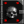
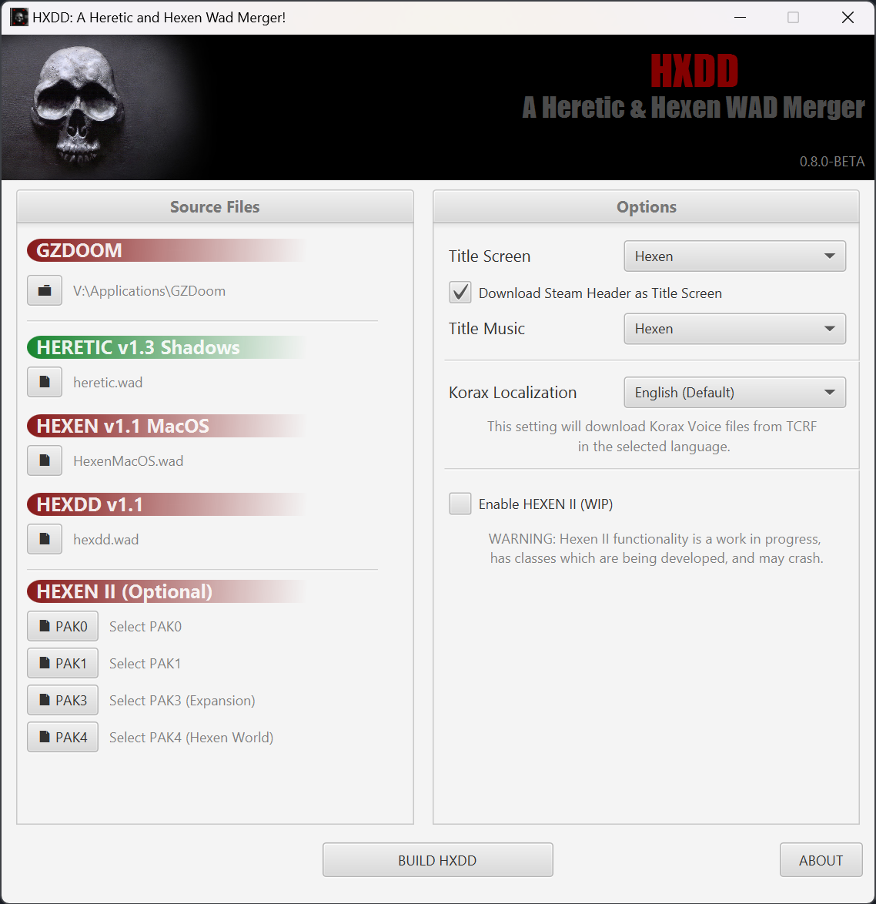

 

  

<h2>HXDD</h2>

A Heretic and Hexen Wad Merger

  

     
    <a href="https://www.doomworld.com/forum/topic/136255-hxdd-a-heretic-hexen-wad-merger-071-beta/"><strong>DOOMWORLD THREAD »</strong></a>
     
     
    <a href="https://github.com/Lemon-King/HXDD/issues">Report Bug</a>
    ·
    <a href="https://github.com/Lemon-King/HXDD/issues">Request Feature</a>
  

 

 

 

 

 

**HXDD** takes everything from Heretic, Hexen and other games. Then arranges and converts them into a new GZDOOM compatible format, allowing you play them as if they were a single game.
There is a fair amount of code acting as glue to make everything functional - not to mention numerous (optional) added features.

This project is inspired by [WADSMOOSH](https://jp.itch.io/wadsmoosh) by JP LeBreton. Go check it out too.

  

## Features

* **Unified Game & Episode Structure** Play Heretic, Hexen and Deathkings from one menu with any class from either game!
* **PWAD Mode** Why stop with Heretic and Hexen. Bring all the features into DOOM and your existing wads for more content!
* **Hexen II Classes** Starting with the Paladin, Hexen II classes are considered playable!
* **Hexen II Leveling** A vastly expanded version of the leveling system found in Hexen II.
* **Selectable Armor Modes** Choose between Basic and AC, compatible with all characters from all games!
* **Mod Support via PlayerSheets** Allows for cross game pickups and actors and expanded PlayerClass definitions. PlayerSheets will allow your mod to support HXDD only features without needing to expand actors or make another version of your mod. Just create a new json under playersheets/.json and you're ready to start!
* **Korax Localization** Select between English, French, German, and Japanese for languages used by Hexen 64 Localizations.
* **Title Screen Customization** Change the Artwork and Music to any of the games in the series, also has support for using Steam's Hero Artwork as Titles.
* **Multiplayer Support** Grab some friends, pick a class, and cause some chaos!

## Current Upcoming & Planned Features
* **Hexen II Classes** You can use many of the classes now in a **WORK IN PROGRESS** state. Focusing on finishing these classes are next for the major gameplay updates.
* **Heretic II Corvus** Currently in an [prototyping phase](https://www.youtube.com/watch?v=RV1bI9vbNs8), due to the amount of work required.

## Getting Started

A modern version of Windows or Wine on MacOS and Linux.

HXDD has a minimum requirement with [GZDOOM 4.11+](https://zdoom.org/downloads) or [VKDOOM](https://vkdoom.org/), if you do not have it please download it. 

Download HXDD from [Releases](https://github.com/Lemon-King/HXDD/releases) and unzip it into its own folder.

## Setup

HXDD will make use of data from GZDOOM/VKDOOM, Heretic, Hexen, Hexen's expansion Deathkings, and optionally Hexen II plus its Expansions. 

1. Launch HXDD.exe
2. Select your GZDOOM or VKDOOM Folder
3. Select your Heretic wad File (**heretic.wad**)
4. Select your Hexen wad File (**hexen.wad**)
5. Select your Hexen DeathKings wad file (**hexdd.wad**)
6. Choose the options you want to utilize - if any.
7. Click on **Build HXDD** to start building hxdd.ipk3 - this may take more than a few minutes.
8. When complete, copy hxdd.ipk3 to where you keep your wads for GZDOOM or VKDOOM.
9. Run GZDOOM or VKDOOM and select HXDD.

Your selections will be stored for the next time you run it.

## Hexen II PAK Support

When using Hexen II PAK files with HXDD you will need [Noesis by Rich Whitehouse](https://richwhitehouse.com/index.php?content=inc_projects.php&showproject=91). 
Download and place the Noesis zip file in the same folder as HXDD's exe. 
Select the PAK files in the application and ensure Enable Hexen II is checked. 
HXDD will use Noesis to open PAK files and export model data for use with GZDOOM.

## DOOM Compatibility「PWAD Mode」
You can also use HXDD.ipk3 as a PWAD with DOOM, DOOM II, and [WadSmoosh](https://jp.itch.io/wadsmoosh). 
Adding **-file HXDD.ipk3** to any DOOM IWAD.

### Youtube Videos

### Screenshots

 

## License

Distributed under the MIT License. See `LICENSE.md` for more information.

## Contact

Lemon King - [@lemonkingi](https://twitter.com/lemonkingi)

Doomworld Thread - [HXDD: A Heretic & Hexen WAD Merger](https://www.doomworld.com/forum/topic/136255-hxdd-a-heretic-hexen-wad-merger-071-beta/)

(<a href="#readme-top">back to top</a>)
